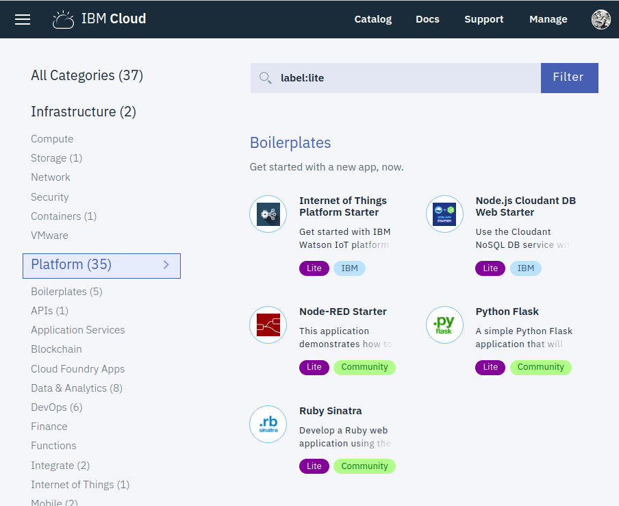
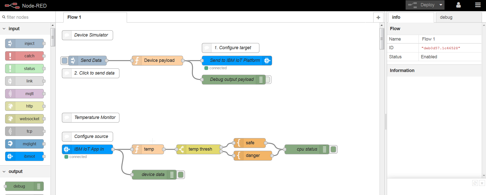
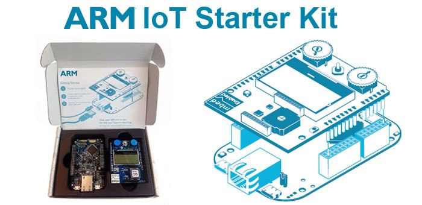
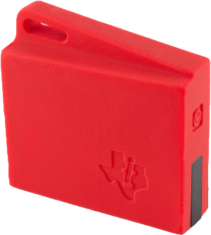

# Introduction to IOT on IBM Watson and Cloud Platform

. Ross Cruickshank

. Digital Ecosystems - Developer Advocate

. ross@vnet.ibm.com

. @rcruicks

# Topics
+ Demo
   What you will be able to do
+ Node-RED
   "low code” applications from diagrams
+ Cloud Platform
 + Internet of Things
 + Runtimes
 + Data service
 + Watson cognitive
+ Data Science Experience
 + Collaborate in stats and machine learning
+ Anything else of interest ...

# Basic components

## Prerequisites
+ IBM Cloud account - sign up at [bluemix.net](http://console.bluemix.net)
+ Laptop with wifi access to Internet
  + power supply/battery to last 2-3 hours
  + USB A host port power donating power to IOT devices
  + optional ethernet port

## Application Runtime

We will be using the _Internet of Things Platform Starter_ boilerplate, available in the IBM Cloud Catalog:

This creates a [Node-RED](http://nodered.org) application, with a built-in _IDE (Integrated Development Environment)_

## IOT hardware

### ARM mbed
The simplest integrated IOT starter kit available is the [Arm mbed starter kit](https://os.mbed.com/platforms/IBMEthernetKit).

this kit is ethernet-only, but has on-board sogftware which will enable it to communicate directly and independently with the _IBM Internet of Things Platform_; just plug it into an internet-connected ethernet port, and go!.

If there is noeasily accessible ethernet port, but your laptop has ethernet and wifi, you can try enabling _internet connection sharing_ to allow the kit to reach the internet via your laptop wifi service.

### Texas Instruments SimpleLink SensorTag
An alternative to the ARM kit is another integrated sensor starter kit from [Texas Instruments SensorTag](http://www.ti.com/ww/en/wireless_connectivity/sensortag/), which uses ** BLE ** (Bluetooth Low Energy) to communicate to the internet via an app on a mobile device [App store - Sensortag](https://itunes.apple.com/gb/app/ti-sensortag/id552918064?mt=8) and [Android Simplelink](https://play.google.com/store/apps/details?id=com.teksun.ble.sensortag&hl=en)  

## IOT platform

The hardware devices are designed to transmit sensor data to a cloud IOT platform - a service which can handle high rates of messaging traffic being published from very large numbers of devices, and support enterprise-scale subscribing applications to process the messages.

We will be using the [_IBM Watson Internet of Things Platform (**WIOTP**)_](http://internetofthings.ibmcloud.com), as the indicated devices are preconfigured to use this platform.

## data storage

to derive value from IOT device data, you will need a database of sorts to store copies of the data messages from the devices; this will allow you to replay data over time, but maily it will allow for bulk data analysis in modelling and prediction systems.

Because _node-RED_ applications in the IBM Cloud environment use the [Cloudant key:value database](https://www.ibm.com/cloud/cloudant) to hold their configuration, it means there is always a data-store readily accessible to the application. For initial sensor data capture, we will use _cloudant_.

## data analysis
in brief, we will cover 3 types of data analysis:  
1. in-stream, message at a time, near real-time through programming (_node-RED_)
1. bulk analysis using end-user visualisation and exploration tools ([_Watson Analytics_](http://watson.analytics.ibm.com))
1. bulk analysis using modelling and statistical tools ([_Data Science Experience - **DSX**_](http://datascience.ibm.com))

# Next: [Setup](setup.md)
