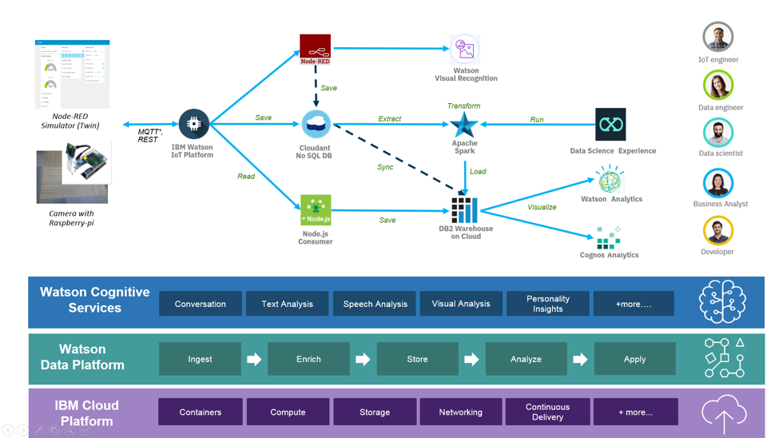

# Setup

The basis of this project makes use of the IBM Code Cookbook
[IoT Event Monitoring and Analytics cookbook](developer.ibm.com/iotplatform/resources/iot-event-monitoring-cookbook) which uses Node-RED to create a simulator for a set of virtual elevators:

There are two approaches to generating data from this cookbook:
1. following instructions in the section [Simulate an Elevator - All using Node-RED nodes](https://developer.ibm.com/recipes/tutorials/simulate-an-elevator-all-using-nodered-nodes/)
1. create a standard IOT Start Boilerplate application, and add the simulator function later.

The first option requires modifications as the standard deployment has some settings which make it incompatible with IBM Cloud Lite accounts. The memory setting is initially 528MB well over the 256MB limit. This needs to be corrected before the application will even start. Once set to 256MB, the application will launch, but may struggle to run a full set of 10 elevtors -- reducing this to 5 will help to avoid out-of-memory errors when the application is running.

The second option allows for much greater control over the components and settings  while building the application; however, experience has shown that some users have difficulty installing the `node-red-dashboard` module.
